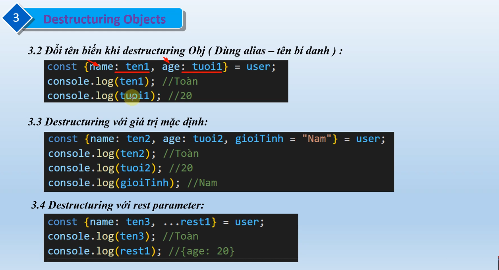

# Train React

## Module

- Một file chứa mã js mà có thể tái sử dụng ở các file khác
- Chia nhỏ ứng dụng thành các phần nhỏ.
- Export: chia sẽ các hàm, biến, class từ một module

### name export: Cho phép export nhiều phần tử từ 1 file

`Khi import: import {a, abc} from ./name.js / import * as name from ./name.js`

- Có 2 cách: - const a = 10;
  function abc(){};
  export {a,abc}; - export const a = 10;
  export function abc(){};

### default export: mỗi module chỉ có 1 file

`Khi import: import a from ./name.js`

- const a = 10;
  export default a;

## Detructuring Array

`const userName = [ "a","b","c" ]`

const [user1, user2, user3] = userName;
// user1 = "a" ...

### Bỏ qua phần tử với dấu phẩy

const [user1, , user2] = userName;
// user1 = "a";
// user2 = "c"

### Với giá trị mặc định

const [user1, user2, user3, user4= "d"]= userName;
//user1 = "a"
// ...
//user4 = "d"

### Với rest parameter

const [user1, ...rest] = userName
//user1 = "a"
//rest = ["d", "c"]

## Detructuring Object

    const object = {
    name: "G",
    age: 2
    }

    const {name, age} = object;

-->Tên biến phải trùng với tên thuộc tính
Xem thêm: 
