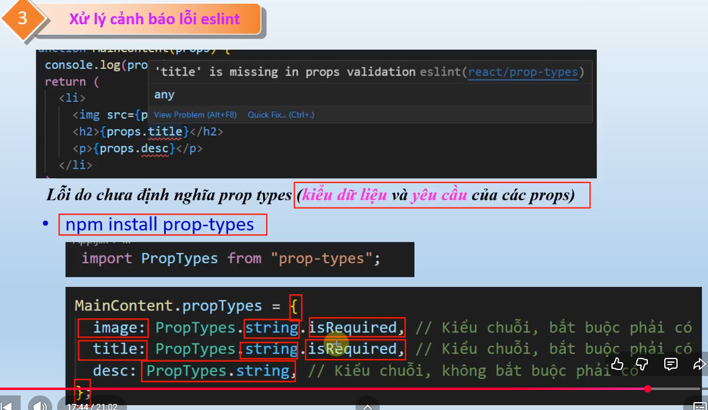

# Trainning ReactJs

## Props & State

- Detructuring: {props}
- spread: ...props

### Props

- Props (properties) là cơ chế để truyền dữ liệu từ component cha xuống component con trong React. (giống như gọi hàm với tham số)

- VD:
  // Component con nhận props
  function Greeting({ name, age }) {
  return 
Xin chào {name}, {age} tuổi!
;
  }
  // Component cha truyền props xuống
  function App() {
  return <Greeting name="Giang" age={24} />;
  }

- Cốt lõi:
  - Chỉ đi 1 chiều: cha truyền xuống con, không chiều ngược lại.
  - Read-only: con chỉ đọc, không được sửa props.
  - Có thể truyền mọi kiểu dữ liệu: string, number, array, function...

- Bắt lỗi eslint: 

- Children props: Hiển thị nội dung bên trong cặp thẻ đóng mở
  - Tự động chứa mọi thứ bên trong cặp thẻ mở và thẻ đóng
  - VD:
    - function TabButton(props){
      return (
        <li>
        <button>{props.children}</button>
        </li>
      );
      }
      <TabButton>Add<TabButton>
